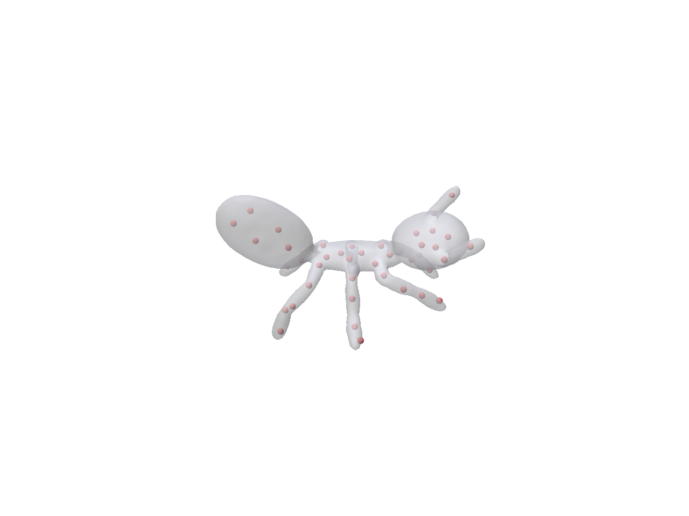
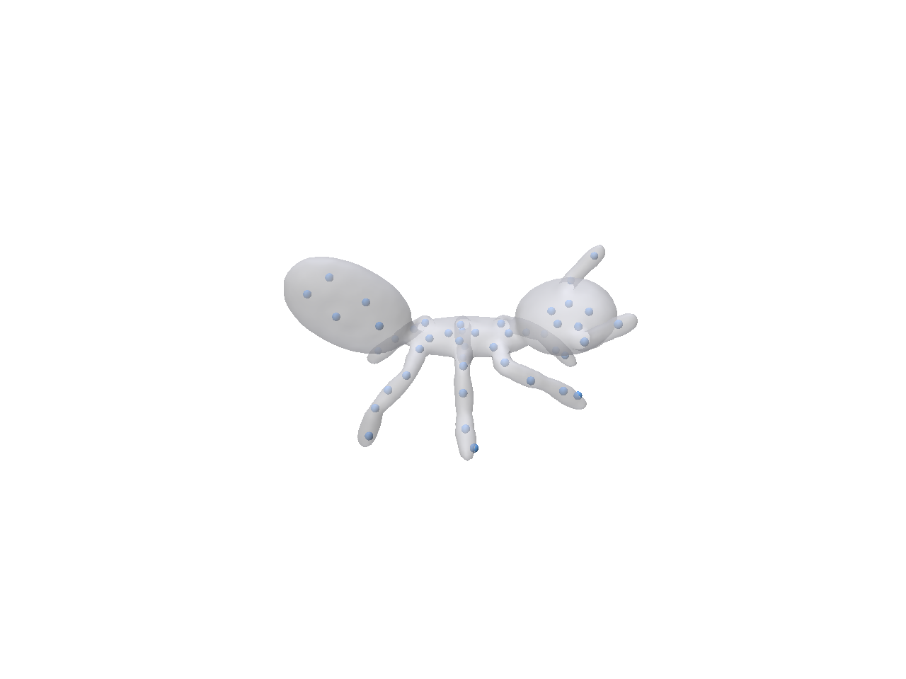
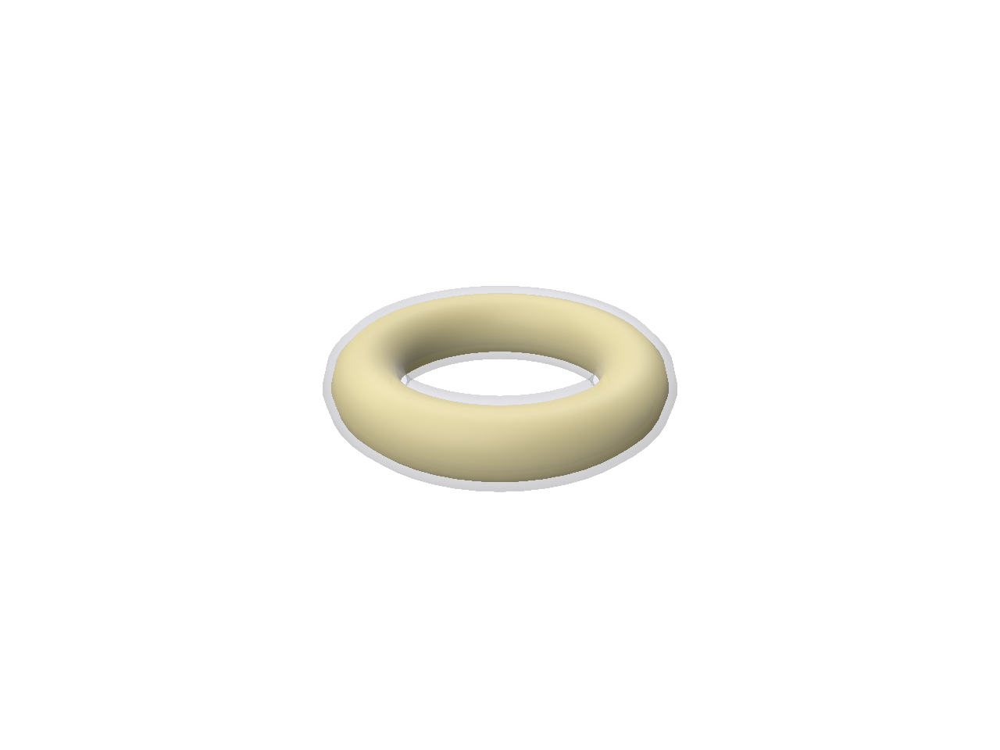
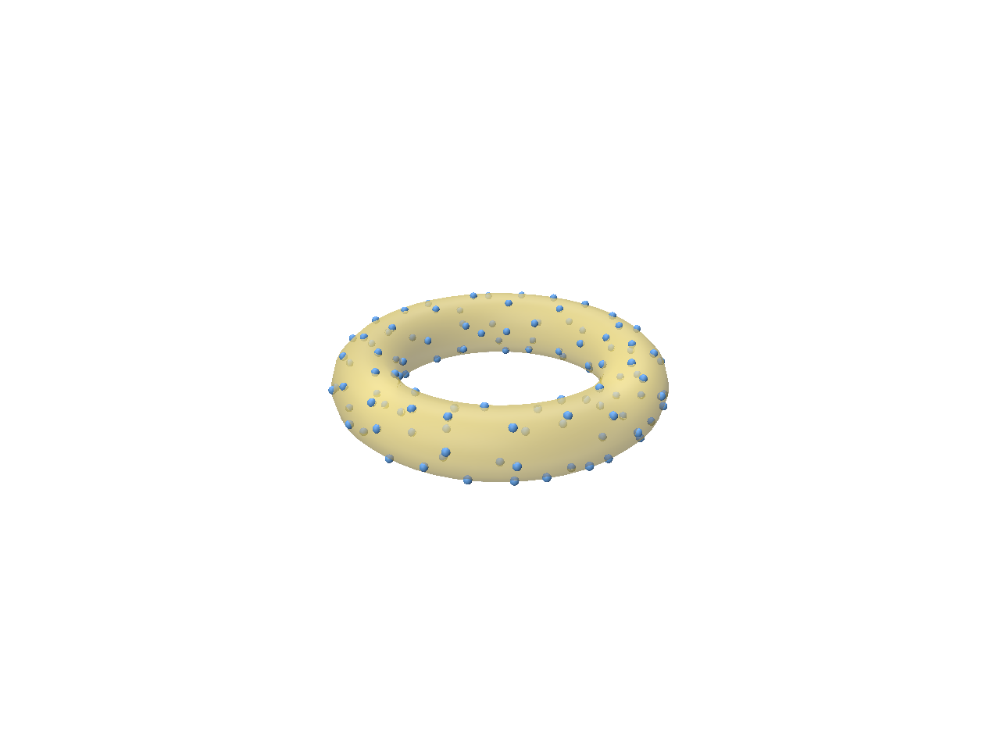

# Coverage Axis (GPU)

GPU-accelerated exact solver for the point-selection step of
[Coverage Axis](https://github.com/Frank-ZY-Dou/Coverage_Axis) (Dou et al. 2022).

Coverage Axis selects inner skeletal points by solving a 0-1 set cover program
over a finite surface sample:

```
min  sum_i x_i
s.t. sum_{i : ball i covers surface point j} x_i >= 1   for every j
     x_i in {0,1}
```

`x_i = 1` keeps inner ball `i`. This solver computes the same optimal selection
as the original Coverage Axis (no heuristic), but faster:

- the coverage relation is built as packed bitsets on the GPU (NVIDIA Warp);
- the integer program is solved exactly with CP-SAT (OR-Tools) or HiGHS;
- an optional presolve (unique-cover forcing, dominance, dedup) shrinks it
  without changing the optimum.

## Why

The original Coverage Axis builds the coverage matrix `D` and solves it with
`scipy.optimize.milp` (HiGHS) under a time limit. On larger inputs that solve
dominates the runtime. Building `D` on the GPU and solving with a parallel
CP-SAT backend gives the same optimal selection in less time.

## Speed

Beagle surface, one RTX 2080 Ti, CP-SAT with 8 workers:

```
8000 surface points x 6000 candidates
  coverage build : numpy 2.28s  ->  GPU 0.02s     (identical coverage)
  exact solve    : HiGHS 11.66s ->  CP-SAT 3.00s   (objective 42, proven optimal)
  end-to-end     : 13.93s       ->  3.02s          (same optimum)

2500 x 2500  ->  objective 22, same optimum
```

Two caveats when reading these. CP-SAT uses 8 threads while `scipy.milp` is
serial, so some of the solve speedup is parallelism. The GPU-build and
end-to-end times are steady-state; the first run also pays a one-time ~7 s
Warp/CUDA startup. The selection is the same either way.

## Verification

`verify.py` checks the result without relying on the solver's own "optimal" flag:

- feasibility: recompute the coverage from the raw geometry and confirm the
  selection covers every surface point;
- two independent solves (HiGHS and CP-SAT) return the same objective;
- LP lower bound: `ceil(LP relaxation)` equals the objective, which proves it is
  optimal;
- brute force: on small random instances the result matches the exhaustive
  minimum cover.

## Install

```bash
pip install warp-lang ortools scipy numpy        # CP-SAT backend (recommended)
# scipy alone is enough for the HiGHS backend
pip install polyscope                             # optional, for viz_scp.py
```

A CUDA GPU is used for the coverage build (NVIDIA Warp); a CPU fallback is
included.

## Usage

Run from this directory (uses the repo's sample mesh in `../input/`):

```bash
# 1. build an SCP instance (surface samples, inner candidates, radii) from a mesh
python gen_instance.py --off ../input/01Ants-12_mesh.off --out ants.npz \
    --n-candidates 3000 --n-surface 3000 --dilation 0.03

# 2. compare backends (solution + runtime)
python compare.py --inst ants.npz

# 3. independent optimality / feasibility check
python verify.py  --inst ants.npz --brute

# 4. visualize: reference vs GPU selection over the surface (headless EGL -> figs/)
python viz_scp.py --off ../input/01Ants-12_mesh.off --inst ants.npz --name ants
```

The selected inner points are drawn as spheres over the surface. Both solvers
reach the same optimum (46 poles, proven); they can pick different but
equally-optimal pole sets.

<table>
<tr>
<td align="center"><br/><sub>reference solver (HiGHS) — 46 poles</sub></td>
<td align="center"><br/><sub>GPU solver — 46 poles</sub></td>
</tr>
</table>

Programmatic use:

```python
import numpy as np, scp_fast as SF
inst = np.load("ants.npz")
res = SF.coverage_axis_fast(inst["surface"], inst["centers"], inst["radii"], backend="cpsat")
selected = res["selected"]          # indices of the chosen inner points
print(res["objective"], res["proven_optimal"])
```

## Example: double cover of a torus

Offset a surface inward and outward along its normal to get two parallel shells.
Sampling candidate balls on the *original* surface, Coverage Axis picks a small
set whose balls cover the points on both shells, so the selected original-surface
points form a sampling that covers the whole doubled band.

```bash
python make_double_cover.py --in ../input/Torus.obj --out double_torus.off --delta 0.025
python gen_instance.py --off double_torus.off --candidate-off ../input/Torus.obj \
    --out double_torus.npz --on-surface --n-candidates 1200 --n-surface 700 --cover-radius 0.045
python compare.py  --inst double_torus.npz
python viz_scp.py  --off double_torus.off --inst double_torus.npz --name double_torus
```

Both solvers return 113 poles, proven optimal. A smaller `--cover-radius` gives
denser poles; a larger one gives fewer poles but a combinatorially harder solve.

<table>
<tr>
<td align="center"><br/><sub>original mesh (yellow) + double cover</sub></td>
<td align="center"><br/><sub>original mesh + selected points</sub></td>
</tr>
</table>

## Files

| file | role |
|---|---|
| `scp_fast.py`  | GPU/Warp bitset coverage build, vectorized presolve, exact-solve pipeline |
| `scp_exact.py` | coverage CSR, full presolve (dominance reductions), CP-SAT / HiGHS solvers |
| `gen_instance.py` | build an SCP instance from a mesh (inner candidates, or `--on-surface`) |
| `make_double_cover.py` | offset a mesh +/- delta along normals into two shells |
| `compare.py`   | solution + runtime comparison of the backends |
| `verify.py`    | feasibility / LP-bound / brute-force checks |
| `bench_scp.py` | reference-vs-accelerated benchmark asserting identical optimum |
| `viz_scp.py`   | polyscope visualization: reference (red) vs GPU (blue) selected poles |

## Citation

```bibtex
@article{dou2022coverage,
  author  = {Dou, Zhiyang and Lin, Cheng and Xu, Rui and Yang, Lei and Xin, Shiqing and Komura, Taku and Wang, Wenping},
  title   = {Coverage Axis: Inner Point Selection for {3D} Shape Skeletonization},
  journal = {Computer Graphics Forum},
  volume  = {41},
  number  = {2},
  pages   = {419--432},
  year    = {2022}
}
```

## License

[MIT](LICENSE).
