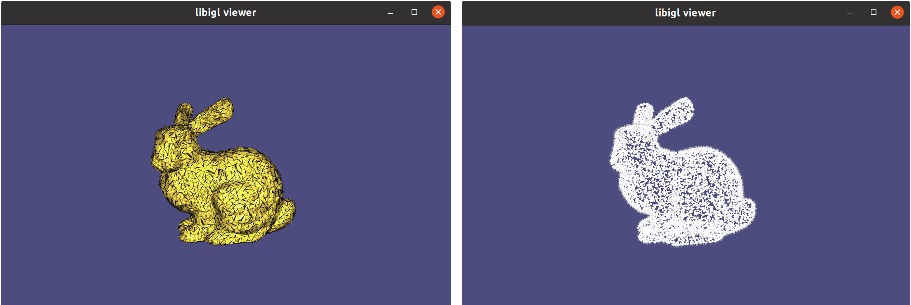
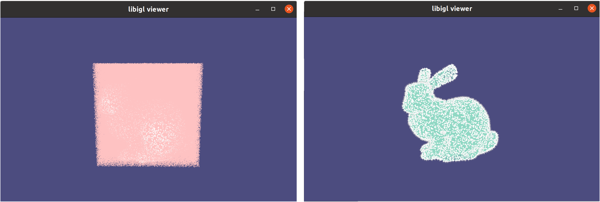
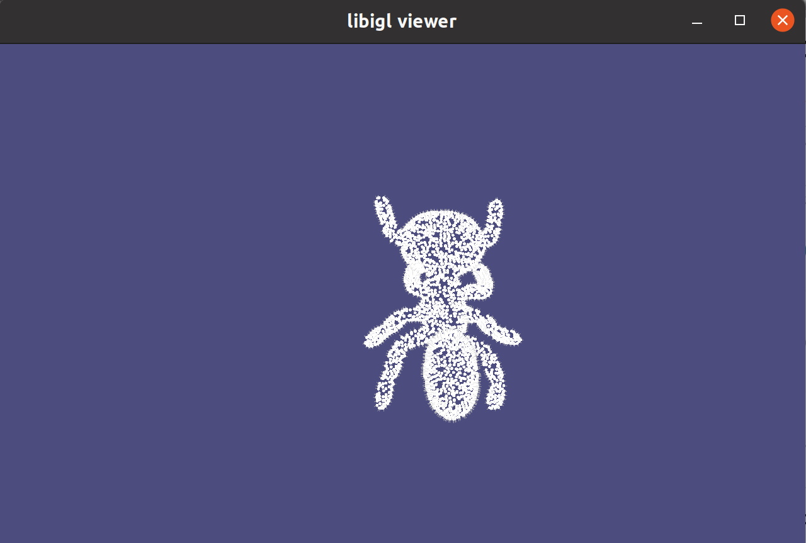
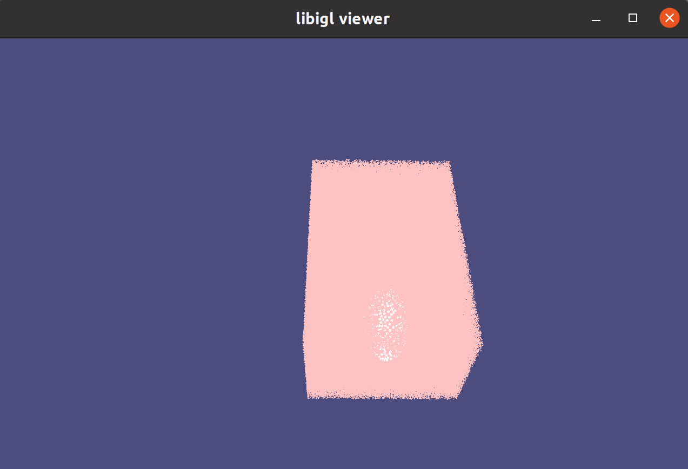
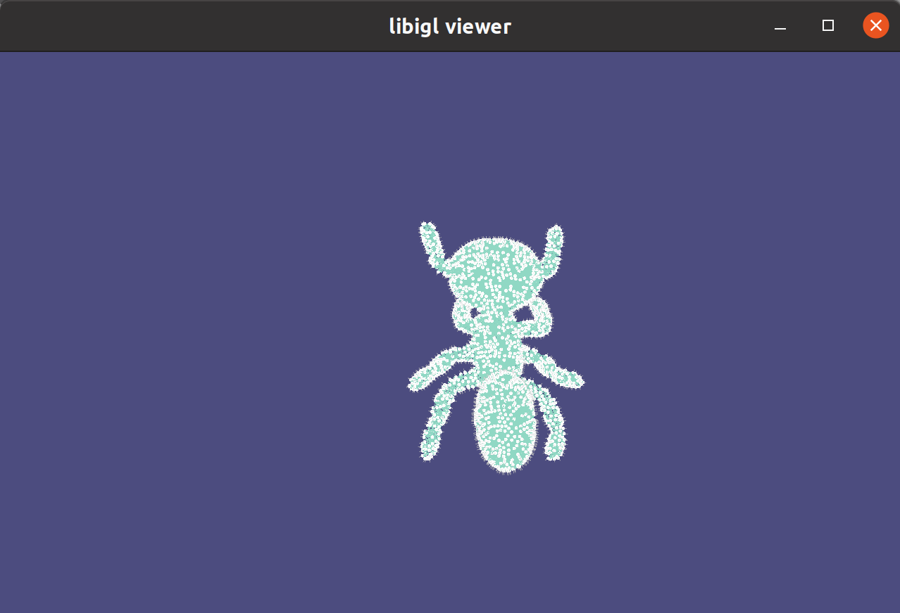

# Introduction
- 🌟Coverage Axis.
  - We provide Coverage Axis computation for both mesh and point cloud inputs. 
    - The point cloud can be **unoriented** -> check out our latest SIGGRAPH 2023 work [here](https://xrvitd.github.io/Projects/GCNO/index.html).
  - Operations are accelerated by GPU, e.g., computation of coverage matrix and winding number for a mesh.
  - We provide codes for building connectivity in [skel_connection](skel_connection): [README.md](skel_connection%2Freadme.md).
- 🌟Coverage Axis++.
  - Coverage Axis++: Efficient Inner Point Selection for 3D Shape Skeletonization: https://arxiv.org/abs/2401.12946.

Some geometry tools for MAT and related topics: [Geometry_Tools](https://github.com/Frank-ZY-Dou/Geometry_Tools).

🐱 **[Coverage Axis: Inner Point Selection for 3D Shape Skeletonization
](https://arxiv.org/abs/2110.00965), Eurographics 2022**.

```diff
+ Top Cited Article in Computer Graphics Forum (CGF) 2022-2023.
```


Authors: [Zhiyang Dou](https://frank-zy-dou.github.io/), 
[Cheng Lin](https://clinplayer.github.io/), 
[Rui Xu](https://xrvitd.github.io/index.html), 
[Lei Yang](https://www.linkedin.cn/incareer/in/lei-yang-842052119),
[Shiqing Xin](http://irc.cs.sdu.edu.cn/~shiqing/index.html),
[Taku Komura](https://i.cs.hku.hk/~taku/), 
[Wenping Wang](https://engineering.tamu.edu/cse/profiles/Wang-Wenping.html).

[[Project Page](https://frank-zy-dou.github.io/projects/CoverageAxis/index.html)][[Paper](https://arxiv.org/abs/2110.00965)][[Code](https://github.com/Frank-ZY-Dou/Coverage_Axis)]


In this paper, we present a simple yet effective formulation called Coverage Axis for 3D shape skeletonization. Inspired by the set cover problem, our key idea is to cover all the surface points using as few inside medial balls as possible. This formulation inherently induces a compact and expressive approximation of the Medial Axis Transform (MAT) of a given shape. Different from previous methods that rely on local approximation error, our method allows a global consideration of the overall shape structure, leading to an efficient high-level abstraction and superior robustness to noise. Another appealing aspect of our method is its capability to handle more generalized input such as point clouds and poor-quality meshes. Extensive comparisons and evaluations demonstrate the remarkable effectiveness of our method for generating compact and expressive skeletal representation to approximate the MAT.

🐱 **[Coverage Axis++: Efficient Inner Point Selection for 3D Shape Skeletonization
](https://arxiv.org/abs/2401.12946), SGP 2024**.

Authors: Zimeng Wang*, 
[Zhiyang Dou*](https://frank-zy-dou.github.io/),
[Rui Xu](https://xrvitd.github.io/index.html),
[Cheng Lin](https://clinplayer.github.io/), 
[Yuan Liu](https://liuyuan-pal.github.io/), 
[Xiaoxiao Long](https://www.xxlong.site/), 
[Shiqing Xin](http://irc.cs.sdu.edu.cn/~shiqing/index.html), 
[Lingjie Liu](https://lingjie0206.github.io/), 
[Taku Komura](https://www.cs.hku.hk/index.php/people/academic-staff/taku), 
[Xiaoming Yuan](https://hkumath.hku.hk/~xmyuan/),
[Wenping Wang](https://engineering.tamu.edu/cse/profiles/Wang-Wenping.html).

[[Project Page](https://frank-zy-dou.github.io/projects/CoverageAxis++/index.html)][[Paper](https://arxiv.org/pdf/2401.12946.pdf)][[Code](https://github.com/Frank-ZY-Dou/Coverage_Axis)]


We introduce Coverage Axis++, a novel and efficient approach to 3D shape skeletonization. The current state-of-the-art approaches for this task often rely on the watertightness of the input or suffer from substantial computational costs, thereby limiting their practicality. To address this challenge, Coverage Axis++ proposes a heuristic algorithm to select skeletal points, offering a high-accuracy approximation of the Medial Axis Transform (MAT) while significantly mitigating computational intensity for various shape representations. We introduce a simple yet effective strategy that considers both shape coverage and uniformity to derive skeletal points. The selection procedure enforces consistency with the shape structure while favoring the dominant medial balls, which thus introduces a compact underlying shape representation in terms of MAT. As a result, Coverage Axis++ allows for skeletonization for various shape representations (e.g., water-tight meshes, triangle soups, point clouds), specification of the number of skeletal points, few hyperparameters, and highly efficient computation with improved reconstruction accuracy. Extensive experiments across a wide range of 3D shapes validate the efficiency and effectiveness of Coverage Axis++. 


# Requirements
## System requirements
- Linux Ubuntu 20.04
- Python 3.8
- Nvidia GeForce RTX 3090 (GPU is used for acceleration)
## Installation

```angular2html
conda env create -f ca.yml
conda activate CA
pip install -r requirements.txt
```

# Usage


## Mesh Input
The input mesh `01Ants-12.off` is placed in the folder `input`. The mesh is normalized.

Specify the settings for Coverage Axis in ```Coverage_Axis_mesh.py```
```angular2html
real_name = '01Ants-12'
surface_sample_num = 2000
dilation = 0.02
# inner_points = "voronoi"
inner_points = "random"
max_time_SCP = 100 # in second
```
For Coverage Axis, Run
```angular2html
python Coverage_Axis_mesh.py
```
For Coverage Axis++, Run
```angular2html
python Coverage_Axis_plusplus_mesh.py
```

The outputs are placed in the folder `output`.
- `mesh_inner_points.obj` contains the candidate inner points.
- `mesh.obj` contains the input mesh.
- `mesh_samples_2000.obj` contains the sampled surface points that are covered.
- `mesh_selected_inner_points.obj` contains the selected inner points.

<p align="center">

</p>

You may use randomly generated points inside the volume as inner candidate points by setting `inner_points = "random"
`. Notably, we already generate a sample. If you choose to produce candidates by randomly sampling inside the shape, it can be a little time consuming.

For Coverage Axis, run
```angular2html
python Coverage_Axis_mesh.py
```
For Coverage Axis++, run
```angular2html
python Coverage_Axis_plusplus_pc.py
```


## Point Cloud Input
I will give more instructions on this part.

We use [Fast Winding Number](https://www.dgp.toronto.edu/projects/fast-winding-numbers/) for Inside-outside determination for point cloud inputs.
Note that we use "oriented point cloud" in our paper. You can use [mesh_oriented_pc.py](mesh_oriented_pc.py) to generate this sample given a mesh input.
After running the code you will get the input: [01Ants-12_mesh_ori_pc.obj](input/01Ants-12_mesh_ori_pc.obj) in the folder of [input](input).

> If you want to process **unoriented point clouds**, please check out our SIGGRAPH 2023 work (SIGGRAPH 2023 The Best Paper Award): [Globally Consistent Normal Orientation for Point Clouds by Regularizing the Winding-Number Field](https://xrvitd.github.io/Projects/GCNO/index.html). Our  approach involves developing a smooth objective
function to define the requirements of an acceptable WindingNumber Field, which facilitates the identification of globally consistent normal orientations for Unoriented Point Cloud, even in the presence of noisy normals.
GCNO significantly outperforms previous methods, especially in handling sparse and noisy point clouds, as well as shapes with complex geometry and topology.

Please use the following commands for building the modified [libigl](https://libigl.github.io/tutorial/) at https://github.com/Frank-ZY-Dou/libigl_CA. Note that [Eigen](http://eigen.tuxfamily.org/index.php?title=Main_Page#Download) is needed for libigl; make sure you have installed it.

```angular2html
sudo apt-get install git
sudo apt-get install build-essential
sudo apt-get install cmake
sudo apt-get install libx11-dev
sudo apt-get install mesa-common-dev libgl1-mesa-dev libglu1-mesa-dev
sudo apt-get install libxrandr-dev
sudo apt-get install libxi-dev
sudo apt-get install libxmu-dev
sudo apt-get install libblas-dev
sudo apt-get install libxinerama-dev
sudo apt-get install libxcursor-dev
sudo apt install libeigen3-dev
sudo apt-get install libcgal-dev

git clone https://github.com/Frank-ZY-Dou/libigl_CA.git
cd libigl_CA/
mkdir build
cd build
cmake ../
make -j8
```

Once finished, you will get two executable files under ```bin```: ```807_FastWindingNumber``` and ```807_FastWindingNumber_CA```.
```commandline
cd bin
```

### FastWindingNumber
You will find an executable file `807_FastWindingNumber` in the folder `bin`. This is a tutorial program.  
You can run it by
```commandline
./807_FastWindingNumber
```
Press "1" twice to toggle between viewing the polygon soup and the point cloud.
<p align="center">

</p>
Press "2" twice to toggle between viewing the full query point cloud and the point cloud identified within the volume.
<p align="center">

</p>

### FastWindingNumber_CA
**This is our case.** Please remember to put the input file [01Ants-12_mesh_ori_pc.obj](input/01Ants-12_mesh_ori_pc.obj) in to the bin folder.
```commandline
./807_FastWindingNumber_CA ./01Ants-12_mesh_ori_pc.obj  ./01Ants-12_mesh_inner_points.obj
```
Visulization:
Press "1" to view the point cloud.
<p align="center">

</p>

Press "2" twice to toggle between viewing the full query point cloud and the point cloud identified within the volume—these are the inside candidates we need.
<p align="center">

</p>
<p align="center">

</p>


Once you run this code, you will get the output ```01Ants-12_mesh_inner_points.obj``` - inner candidate points. Please rename it to `01Ants-12_pc_random.obj` and move it to the folder `input`. 
You can downsample the inner points if you want.

Then run
```angular2html
python Coverage_Axis_pc.py
```

The outputs are placed in the folder `output`.
- `pc_inner_points.obj` contains the candidate inner points.
- `pc_samples.obj` contains the points of the point cloud that is covered. **SCP is an NP-hard problem; make sure the number of to-be-covered samples is not that large.** 
- `pc_selected_inner_points.obj` contains the selected inner points.

<p align="center">

</p>

*Remark: We generate the point cloud inputs and inside candidates based on Fast Winding Number. The candidates are generated by randomly sampling inside the volume.
Other sampling strategies, like Voronoi-based sampling, can also be used. The core code for sampling the point cloud and generating inside candidates are given in*
```angular2html
./libigl_CA/tutorial/807_FastWindingNumber_CA/main.cpp
```


# More Information
### Solve Coverage Axis in MATLAB
**update:**
The code in MATLAB can be found in `./MATLAB`.

Run
```commandline
Pole_Selection_offset
```
The results are written to `./MATLAB/outputs`

You could check with output file like `vis_MA_init01Ants-27_scale0.03.obj`.


The original optimization is solved by MATLAB. In this repo, we solve SCP by Scipy in Python. *I found the solver of MILP in scipy is a little unstable compared with the MATLAB one; please suggest if you have a more powerful solver or any idea for this. Thanks ;)*
```angular2html
f =  ones(1,medial_num); 
A =  -D;
b =  -ones(boundary_num,1)*1;%here ,we fix p_i 
lb = zeros(medial_num,1);
ub = ones(medial_num,1);
iint = [1:medial_num];
tic;
[x,fval]=intlinprog(f,iint,A,b,[],[],lb,ub);
toc;
disp('min_number:');
disp(fval);
```


# Citation

```angular2html
@inproceedings{dou2022coverage,
  title={Coverage Axis: Inner Point Selection for 3D Shape Skeletonization},
  author={Dou, Zhiyang and Lin, Cheng and Xu, Rui and Yang, Lei and Xin, Shiqing and Komura, Taku and Wang, Wenping},
  booktitle={Computer Graphics Forum},
  volume={41},
  number={2},
  pages={419--432},
  year={2022},
  organization={Wiley Online Library}
}
```

```angular2html
@inproceedings{wang2024coverage,
  title={Coverage Axis++: Efficient Inner Point Selection for 3D Shape Skeletonization},
  author={Wang, Zimeng and Dou, Zhiyang and Xu, Rui and Lin, Cheng and Liu, Yuan and Long, Xiaoxiao and Xin, Shiqing and Komura, Taku and Yuan, Xiaoming and Wang, Wenping},
  booktitle={Computer Graphics Forum},
  volume={43},
  number={5},
  pages={e15143},
  year={2024},
  organization={Wiley Online Library}
}
```

```commandline
@article{xu2023globally,
  title={Globally consistent normal orientation for point clouds by regularizing the winding-number field},
  author={Xu, Rui and Dou, Zhiyang and Wang, Ningna and Xin, Shiqing and Chen, Shuangmin and Jiang, Mingyan and Guo, Xiaohu and Wang, Wenping and Tu, Changhe},
  journal={ACM Transactions on Graphics (TOG)},
  volume={42},
  number={4},
  pages={1--15},
  year={2023},
  publisher={ACM New York, NY, USA}
}
```

# References
- https://libigl.github.io/tutorial/  Many thanks to the contributors of libigl :)
- https://www.cgal.org/
- https://gist.github.com/dendenxu/ee5008acb5607195582e7983a384e644


